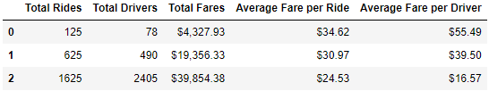
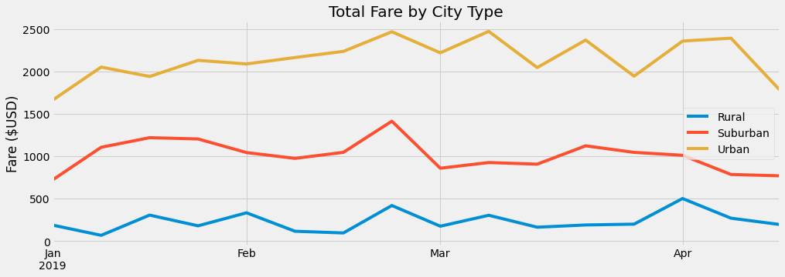

# PyBer_Analysis

## Overview of analysis
The purpose of this project is to organize ridesharing data by city type and display it in tables and graphs to be analyzed.

### Purpose
First, I brought in two csv files to be read in python. the first one contained data regarding the city name, number of drivers, and the type of city. Then I merged the data into a single dataframe. At this point using the dataframes  
the information of the total rides per city, the total drivers per city, and the total fares for each city type was extracted. This was used to calculate total fares for each city type and average fare per driver. This then was displayed
all of this data in a formatted summary dataframe. Then I wanted to visualize the information in a chart from the begining of 2019 to the end of April. In order to do this the initially merged dataframe was referenced and the groupby 
function was used in order to sort the summed up fare for each time and date per city. The dataframe was converted into a pivot chart to restructure the table to see the sum of each type of city at a given timestamp. Then the data was 
converted back to a dataframe and used the .loc method to limit the data to the timeframe of interest. Then the data was reconfigured by modifying the date to display the data by the week using the resample function. Then I plotted the 
graph of the fare summary.

## Results
After creating the summary dataframe and the fare summary line graph the conclusions that can be derived from the data was in line with my expectations.

### Analysis of Summary Dataframe
As expected the total rides in the urban areas make up a large majority of the rides in the analyzed time frames. Suburban total rides came in second and rural rides came in last.  Average fare per driver was highest in rural cities,
with suburban in second and with urban cities having by far the lowest fares. This is expected because of the building density of the city types. In a rural city car ownership is far more crucial due to the significant distance between 
the establishments that the residents would go to daily. It is likely that a larger percentage of the rides were to and from the airport (longer distance less frequent). In contrast, the urban cities are likely to have far less car ownership 
as a percentage as the residents are more likely to visit on a daily basis would be in walking distance. It is likely that a larger percentage of rides were to and from bars (shorter distance more frequent).  The suburban city residents
are in between as expected 

Below is the summary dataframe:

### Analysis of Fare Summary
The fare summary is also as expected. Due to volume the total fare was highest in the city, the next highest was suburban cities, and the lowest was rural cities.

Below is the line graph:

                                                                   

## Summary
Based on the results, it seems that the expected discrepencies are present, but there are some suggestions that could determine whether certain discrepencies can be alleviated. 

 
### Business Recommendations
PyBer could start to collect time data for analysis. This time data would include time between each request and acceptance of the ride by the driver and duration of each ride along with cancellation data. If there are a significant 
number of shorter duration rides that are canceled due to drivers not accepting incentives could be provided to willing drivers to increase the volume of the business in rural areas. In addition a survey could be sent out to all users
of the app to determine if they are satisfied with the availablilty of drivers. Similar analysis can be done to the previous suggestion to determine whether incentives could be provided to increase volume. Lastly PyBer could take a look
at their pricing to determine whether they should consider raising their surge pricing. This could allow them to raise their prices for shorter distance urban travel and allow them to potentially increase their bottom line.
